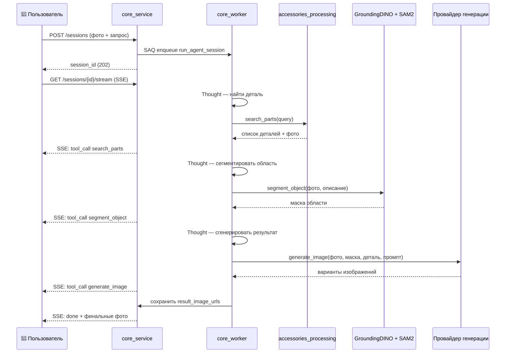

# 2. Проектирование системы

\ 

## 2.1. Требования к системе

\ 

Проектирование системы началось с формализации требований, охватывающих все ключевые аспекты работы сервиса.

**Функциональные требования:**

::: {custom-style="MyNumberedList"}
Пользователь загружает одно или несколько фото автомобиля и описывает желаемое изменение на естественном языке — без заполнения форм, выбора категорий и прочих ручных действий.
:::

::: {custom-style="MyNumberedList"}
Система автоматически находит подходящую деталь в каталоге по семантическому сходству запроса с описаниями деталей.
:::

::: {custom-style="MyNumberedList"}
Система автоматически выделяет область применения детали на фотографии без ручной разметки со стороны пользователя.
:::

::: {custom-style="MyNumberedList"}
Система генерирует несколько вариантов фотореалистичного изображения с применённой деталью.
:::

::: {custom-style="MyNumberedList"}
Пользователь наблюдает за ходом выполнения в режиме реального времени: какие шаги выполнены, что найдено, что сегментировано.
:::

::: {custom-style="MyNumberedList"}
Администратор может загружать новые детали в каталог; система самостоятельно удаляет фон с фотографии и вычисляет векторное представление для поиска.
:::

**Нефункциональные требования:**

::: {custom-style="MyBulletList"}
*Асинхронная обработка:* длительные ML-операции (сегментация, генерация) выполняются в фоновом рабочем процессе и не блокируют ответ сервера. API принимает задачу и немедленно возвращает идентификатор сессии.
:::

::: {custom-style="MyBulletList"}
*Производительность API:* синхронные эндпоинты (получение статуса, поиск по каталогу) должны отвечать не более чем за 200 мс при типовой нагрузке.
:::

::: {custom-style="MyBulletList"}
*Размер входных данных:* поддержка загрузки изображений размером до 20 МБ, разрешением до 4096×4096 пикселей.
:::

::: {custom-style="MyBulletList"}
*Заменяемость модели генерации:* переключение между провайдерами инпейнтинга без изменения логики агента — через единый интерфейс `InpaintProvider`.
:::

::: {custom-style="MyBulletList"}
*Наблюдаемость:* все шаги агента логируются в структурированном формате JSONB и доступны через API в любой момент, в том числе после завершения сессии.
:::

::: {custom-style="MyBulletList"}
*Возможность полностью локального развёртывания:* все компоненты системы могут работать без облачных зависимостей — с использованием локальных весов моделей и локального хранилища файлов.
:::

::: {custom-style="MyBulletList"}
*Изоляция сервисов:* каждый микросервис имеет собственную базу данных и не обращается напрямую к БД другого сервиса.
:::

\ 

## 2.2. Архитектура системы

\ 

### 2.2.1. Обоснование микросервисной архитектуры

Система разделена на два независимых бэкенд-сервиса: `core_service` и `accessories_processing`. Решение о разделении продиктовано следующими соображениями.

Во-первых, **различие зон ответственности**: сервис деталей занимается исключительно управлением каталогом, обработкой изображений и поиском. Основной сервис занимается оркестрацией агента и управлением пользовательскими сессиями. Смешение этих задач в одном сервисе привело бы к возникновению связанных зависимостей и усложнению кодовой базы.

Во-вторых, **независимое масштабирование**: в периоды активной загрузки каталога сервис деталей можно масштабировать горизонтально, не затрагивая основной сервис — и наоборот.

В-третьих, **независимое развёртывание**: обновление логики обработки деталей не требует перезапуска основного сервиса и не влияет на активные пользовательские сессии.

### 2.2.2. Компоненты системы

**Клиентское приложение (SvelteKit)** — единственная точка взаимодействия с пользователем. Реализует два экрана: Studio (загрузка фото и запроса, наблюдение за выполнением агента в реальном времени) и Parts (управление каталогом деталей). Взаимодействует исключительно с `core_service` по HTTP.

**core_service (FastAPI + SAQ)** — основной сервис. Принимает пользовательские запросы, создаёт сессии агента, ставит задачи в очередь, предоставляет SSE-стрим событий. Обращается к `accessories_processing` по внутреннему HTTP для поиска деталей. Хранит состояние сессий и лог событий агента в PostgreSQL.

**accessories_processing (FastAPI + SAQ)** — сервис каталога. Принимает загрузку деталей, запускает фоновую обработку (удаление фона, вычисление эмбеддинга), предоставляет API семантического поиска. Имеет изолированную PostgreSQL с расширением pgvector.

**Redis** — брокер очередей задач для обоих сервисов. Используется библиотекой SAQ для передачи задач от API-процессов к воркерам. Каждый сервис использует отдельный Redis-namespace.

**PostgreSQL** — реляционная база данных. Развёртывается в одном экземпляре, но с двумя изолированными схемами для каждого сервиса. Расширение pgvector обеспечивает хранение и индексирование векторов эмбеддингов.

**Файловое хранилище** — локальная файловая система (в production-конфигурации заменяемая на объектное хранилище). Хранит исходные и обработанные изображения деталей, загруженные фото автомобилей, сгенерированные маски и результаты инпейнтинга. Файлы доступны через статический HTTP-эндпоинт.

### 2.2.3. Взаимодействие компонентов

Взаимодействие строится следующим образом: клиентское приложение отправляет запросы к `core_service`. При необходимости поиска деталей `core_service` обращается к `accessories_processing` по внутреннему HTTP. Оба сервиса используют Redis для передачи задач фоновым воркерам и PostgreSQL для хранения состояния. Файлы сохраняются в общем томе файловой системы, доступном обоим сервисам.

Длительные ML-операции в обоих сервисах выполняются асинхронно: API принимает запрос, создаёт запись в БД, ставит задачу в очередь и сразу возвращает ответ. Воркер забирает задачу из очереди и выполняет её в фоне, обновляя статус в БД по мере прогресса.

### 2.2.4. Контейнеризация

Все компоненты системы упакованы в Docker-контейнеры и описаны в файле `docker-compose.yml`. Это обеспечивает воспроизводимость среды выполнения: набор зависимостей, переменные окружения и конфигурации сети зафиксированы в декларативном описании. Развёртывание всей системы на любой машине с Docker сводится к одной команде `docker compose up`.

Каждый сервис имеет отдельный `Dockerfile` с многоэтапной сборкой: зависимости устанавливаются в отдельном слое, что ускоряет повторные сборки при изменении только кода приложения. ML-модели (SAM 2, GroundingDINO, all-MiniLM-L6-v2, rembg) загружаются при первом запуске и кешируются в именованном Docker-томе, чтобы не скачиваться при каждом перезапуске контейнера.

\ 

## 2.3. Проектирование сервиса деталей

\ 

Сервис `accessories_processing` отвечает за управление каталогом тюнинговых деталей: загрузку фотографий, обработку (удаление фона, вычисление эмбеддинга) и семантический поиск.

### 2.3.1. Модель данных

Центральная сущность — `Part`, описывающая одну деталь каталога. Поле `status` отражает жизненный цикл детали: `pending` (загружена, ожидает обработки) → `ready` (доступна для поиска) → `failed` (ошибка обработки). Поле `embedding` хранит 384-мерный вектор, вычисленный моделью `all-MiniLM-L6-v2` по имени и описанию детали.

| Поле | Тип | Описание |
|---|---|---|
| id | UUID | Первичный ключ |
| name | String | Название детали |
| category | String | Категория (spoiler, wheels, bumper…) |
| domain | String | Область применения (car, moto, interior) |
| original_image_url | String | URL исходного фото |
| processed_image_url | String | URL фото с удалённым фоном |
| description | Text | Текстовое описание |
| status | String | pending / ready / failed |
| embedding | Vector(384) | Векторное представление для поиска |

Для ускорения векторного поиска на поле `embedding` создаётся индекс типа **HNSW** (Hierarchical Navigable Small World). HNSW строит многоуровневый граф, где каждый вектор связан с ближайшими соседями на нескольких уровнях иерархии. При поиске алгоритм начинает с верхнего уровня и жадно движется к ближайшему соседу, постепенно спускаясь к нижнему уровню с наибольшей плотностью связей. Это обеспечивает сложность поиска O(log n) вместо O(n) при полном переборе. Для каталога в тысячи позиций HNSW-индекс сокращает время запроса с миллисекунд до десятков микросекунд.

### 2.3.2. API

Сервис предоставляет REST JSON API для управления каталогом.

| Метод | Путь | Описание |
|---|---|---|
| POST | `/api/parts/upload` | Загрузить деталь (фото + метаданные). Возвращает `task_id` фоновой задачи |
| GET | `/api/parts/` | Список всех деталей с фильтрацией по domain и category |
| GET | `/api/parts/{id}` | Получить деталь по идентификатору |
| DELETE | `/api/parts/{id}` | Удалить деталь |
| POST | `/api/parts/search` | Семантический поиск по текстовому запросу |

Загрузка новой детали осуществляется через `POST /api/parts/upload` — принимает multipart/form-data с фотографией и метаданными (название, категория, домен), сохраняет исходное изображение в файловом хранилище и сразу возвращает `task_id` поставленной в очередь фоновой задачи. Деталь становится доступной для поиска только после перехода в статус `ready`.

### 2.3.3. Фоновая обработка

При загрузке детали воркер выполняет задачу `prepare_part` в три последовательных шага:

**Шаг 1 — Удаление фона.** Исходное изображение детали обрабатывается моделью rembg на базе архитектуры U²-Net (u2net). U²-Net — вложенная U-образная сеть: каждый блок энкодера и декодера сам является миниатюрной U-образной сетью, что позволяет улавливать как локальные детали границ объекта, так и глобальный контекст сцены. Результат — изображение с прозрачным фоном в формате PNG, сохраняемое в файловое хранилище.

**Шаг 2 — Вычисление эмбеддинга.** Модель `all-MiniLM-L6-v2` кодирует конкатенацию полей `name` и `description` детали в 384-мерный вектор. Вектор сохраняется в поле `embedding` записи `Part`.

**Шаг 3 — Обновление статуса.** После успешного завершения обоих шагов статус детали переводится в `ready`. При ошибке на любом из шагов — в `failed` с сообщением об ошибке.

### 2.3.4. Семантический поиск

При получении поискового запроса сервис выполняет следующую последовательность операций: текст запроса кодируется в вектор моделью `all-MiniLM-L6-v2`, затем выполняется запрос к PostgreSQL с оператором косинусного расстояния pgvector (`<=>`) по всем деталям со статусом `ready`. Возвращаются только детали с оценкой косинусного сходства выше порогового значения 0,4 — это отсекает семантически нерелевантные позиции, которые алгоритм ближайшего соседа мог вернуть по поверхностному сходству. Результаты сортируются по убыванию релевантности.

\ 

## 2.4. Проектирование основного сервиса

\ 

Сервис `core_service` управляет сессиями пользователя и выполнением агента.

### 2.4.1. Модель данных

Центральная сущность — `AgentSession`, представляющая один запрос пользователя от момента создания до получения результата.

| Поле | Тип | Описание |
|---|---|---|
| id | UUID | Первичный ключ |
| status | String | pending / processing / complete / failed |
| user_prompt | Text | Запрос пользователя |
| system_prompt | Text | Системный промпт (опционально) |
| car_image_urls | String[] | URL загруженных фото автомобиля |
| events | JSONB | Лог событий агента |
| result_image_urls | String[] | URL сгенерированных результатов |
| error_message | Text | Сообщение об ошибке |

Поле `events` хранит полный журнал выполнения агента в формате JSONB-массива. Каждый элемент массива — структурированное событие с полями `type` (тип события: `thought`, `tool_call`, `tool_result`, `final_answer`), `content` (содержимое) и `timestamp`. Такая структура позволяет клиенту восстановить полную историю выполнения при переподключении к стриму, а также предоставляет материал для отладки и анализа качества работы агента.

### 2.4.2. API

| Метод | Путь | Описание |
|---|---|---|
| POST | `/api/agent/sessions` | Создать сессию: принять фото и запрос, поставить задачу в очередь. Возвращает `session_id` |
| GET | `/api/agent/sessions/{id}` | Получить текущий статус и результаты сессии |
| GET | `/api/agent/sessions/{id}/stream` | SSE-стрим событий агента в реальном времени |

Создание сессии — `POST /api/agent/sessions` — принимает multipart/form-data: одно или несколько фото автомобиля и текстовый запрос пользователя. Сохраняет фотографии в файловое хранилище, создаёт запись `AgentSession` со статусом `pending`, ставит задачу `run_agent_session` в очередь SAQ и возвращает `session_id` с HTTP 202, сигнализируя о принятии задачи в обработку.

### 2.4.3. Механизм SSE-стрима

Для наблюдения за выполнением агента в реальном времени используется Server-Sent Events — стандартный HTTP-механизм однонаправленного стриминга от сервера к клиенту.

Реализация стрима строится на поллинге базы данных: SSE-эндпоинт открывает постоянное HTTP-соединение и каждые 0,5 секунды запрашивает поле `events` сессии из PostgreSQL. Новые события (появившиеся с момента последней проверки) отправляются клиенту как SSE-сообщения. При достижении терминального статуса (`complete` или `failed`) сервер отправляет финальное событие и закрывает соединение.

Выбор поллинга вместо подписки на изменения БД (LISTEN/NOTIFY) обусловлен простотой реализации и достаточной частотой обновлений для задач с длительностью выполнения от нескольких секунд до нескольких минут. Задержка доставки события клиенту составляет не более 0,5 секунды, что приемлемо для данного сценария.

WebSocket не использовался, поскольку задача требует только однонаправленной передачи данных от сервера к клиенту, а двунаправленность WebSocket создаёт избыточную сложность без практической пользы.

### 2.4.4. Пайплайн агента

После создания сессии воркер запускает задачу `run_agent_session`. Агент реализует паттерн ReAct — после каждого шага он наблюдает результат и при необходимости корректирует следующее действие.

**Шаг 1 — Поиск детали.** Агент вызывает инструмент `search_parts` с текстом запроса пользователя. Инструмент обращается к `accessories_processing` через HTTP, получает список релевантных деталей с названиями, описаниями и URL обработанных фотографий. Если детали не найдены — агент сообщает об этом пользователю и завершает выполнение.

**Шаг 2 — Сегментация.** Агент вызывает инструмент `segment_object`, передавая URL фотографии автомобиля и текстовое описание целевой области на английском языке (транслируется агентом из пользовательского запроса). GroundingDINO локализует объект и возвращает bounding box, SAM 2 строит точную бинарную маску. Маска сохраняется в файловом хранилище и возвращается агенту как URL.

**Шаг 3 — Генерация.** Агент вызывает инструмент `generate_image`, передавая провайдеру фото автомобиля, маску, фото детали и текстовый промпт. Промпт строится строго из данных, полученных на шагах 1 и 2 — без добавления визуальных деталей из знаний языковой модели, что предотвращает галлюцинации. Провайдер возвращает несколько вариантов результата, которые сохраняются в поле `result_image_urls` сессии.

Каждое событие агента — мысль, вызов инструмента, результат инструмента — немедленно добавляется в поле `events` сессии и тем самым становится доступным через SSE-стрим.

\ 

## 2.5. Выбор технологического стека

\ 

### 2.5.1. Бэкенд-фреймворк

Для реализации бэкенда рассматривались три основных Python-фреймворка: Django, Flask и FastAPI. Django является полнофункциональным фреймворком с встроенным ORM и панелью администратора, однако его архитектура изначально ориентирована на синхронный WSGI, что создаёт накладные расходы при работе с асинхронными ML-операциями. Flask — лёгкий синхронный фреймворк, удобный для небольших приложений, но также не имеющий нативной асинхронности. FastAPI построен на ASGI и asyncio, что позволяет обрабатывать несколько запросов одновременно без блокировки — критически важно для сервиса, выполняющего длительные ML-операции. Дополнительные преимущества: автоматическая генерация OpenAPI-документации и валидация данных через Pydantic. В независимом бенчмарке (Linux, Python 3.13, нагрузка: JSON-эндпоинты, чтение из БД, токен-авторизация) FastAPI показал ~440 запросов/с при латентности ~11 мс, Flask — ~344 запросов/с при ~14 мс (Afolabi, 2024).

### 2.5.2. Очередь задач

ML-операции занимают от нескольких секунд до нескольких минут и не могут выполняться в рамках одного HTTP-запроса. Для их вынесения в фоновый процесс рассматривались Celery, RQ и SAQ. Celery — наиболее функциональное решение с поддержкой множества брокеров и сложных граф задач, однако требует значительной конфигурации и является избыточным для данного масштаба. RQ (Redis Queue) — лёгкая библиотека поверх Redis, однако синхронная по своей природе и несовместимая с async-функциями FastAPI без дополнительных обёрток. SAQ (Simple Async Queue) — асинхронная очередь, нативно работающая с asyncio, что позволяет использовать те же async-функции, что и в основном приложении. Задержка постановки задачи в очередь составляет менее 5 мс. Для масштаба проекта SAQ обеспечивает достаточную функциональность при минимальной конфигурации, используя Redis как единственный брокер.

### 2.5.3. База данных и векторный поиск

Для хранения каталога деталей требовались как реляционная БД (метаданные, статусы), так и возможность векторного поиска по эмбеддингам. Специализированные векторные базы данных (Pinecone, Weaviate) предоставляют высокую производительность при большом числе векторов, однако требуют развёртывания отдельного сервиса либо оплаты облачного тарифа. Расширение pgvector добавляет в PostgreSQL тип `vector` и индексы поиска ближайших соседей, позволяя хранить реляционные данные и векторы в одной базе. При каталоге деталей в тысячи позиций производительность pgvector полностью достаточна, а дополнительный сервис для векторного поиска не требуется.

### 2.5.4. Модель эмбеддингов

Для кодирования текстовых описаний деталей выбрана модель `all-MiniLM-L6-v2` из библиотеки sentence-transformers. Модель содержит 22 млн параметров, весит около 22 МБ и генерирует 384-мерные векторы. Она работает в 5 раз быстрее более качественных аналогов (например, `all-mpnet-base-v2`) при незначительной потере точности на задачах семантического сходства. Принципиально важно, что модель полностью открытая и запускается локально — без API-ключей и передачи данных сторонним сервисам.

### 2.5.5. Хранилище файлов

Система работает с тремя типами файлов: исходные и обработанные изображения деталей, загруженные фото автомобилей, сгенерированные маски и результаты инпейнтинга. В базовой конфигурации используется локальная файловая система с монтированием общего тома Docker, доступного обоим сервисам. Файлы отдаются через статический HTTP-эндпоинт FastAPI. Такой подход не требует внешних зависимостей и достаточен для разработки и малонагруженного production. Для масштабируемого развёртывания предусмотрена замена на объектное хранилище (S3-совместимый API) без изменения логики приложения — достаточно переключить переменную окружения `STORAGE_BACKEND`.

### 2.5.6. Клиентское приложение

Для разработки клиентского приложения рассматривались React, Vue и SvelteKit. React — наиболее распространённый фреймворк с крупнейшей экосистемой, однако требует загрузки около 40 КБ runtime-кода до выполнения приложения. Svelte компилируется в нативный JavaScript на этапе сборки, без виртуального DOM и без runtime-фреймворка в браузере — результирующий бандл в 5–10 раз меньше, чем у React. По данным Stack Overflow Developer Survey 2024, Svelte занимает первое место по удовлетворённости разработчиков среди фронтенд-фреймворков (72,8%). SvelteKit добавляет к Svelte маршрутизацию, серверный рендеринг и файловую структуру проекта.

### 2.5.7. Стриминг событий

Поскольку агент работает от нескольких секунд до нескольких минут, пользователю необходимо видеть промежуточные шаги в реальном времени. Для этого подходят WebSocket и SSE. WebSocket обеспечивает двунаправленную связь, что избыточно для данной задачи: события идут только от сервера к клиенту. SSE — стандартный HTTP-механизм однонаправленного стриминга, нативно поддерживаемый всеми современными браузерами через `EventSource` API, не требующий специальной инфраструктуры и работающий поверх обычного HTTP/1.1. FastAPI поддерживает SSE через `StreamingResponse`.

### 2.5.8. Сводная таблица технологического стека

| Компонент | Выбранное решение | Альтернативы | Обоснование выбора |
|---|---|---|---|
| Бэкенд-фреймворк | FastAPI | Django, Flask | Нативный async, автодокументация |
| Очередь задач | SAQ | Celery, RQ | Нативный asyncio, минимальная конфигурация |
| База данных | PostgreSQL + pgvector | MySQL, MongoDB | Единая БД для реляционных данных и векторов |
| Эмбеддинги | all-MiniLM-L6-v2 | all-mpnet-base-v2 | Скорость, компактность, локальный запуск |
| Хранилище файлов | Локальная ФС / S3 | MinIO, Cloudflare R2 | Простота, заменяемость через ENV |
| Фронтенд | SvelteKit | React, Vue | Малый бандл, высокая удовлетворённость |
| Стриминг | SSE | WebSocket | Однонаправленный поток, нет лишней сложности |
| Контейнеризация | Docker + Compose | — | Воспроизводимая среда, единая команда запуска |

\ 

## 2.6. Выводы по главе

\ 

Проведённое проектирование позволяет сформулировать следующие выводы:

::: {custom-style="MyNumberedList"}
Микросервисная архитектура с разделением на `core_service` и `accessories_processing` обеспечивает независимое масштабирование и развёртывание компонентов системы при чётком разграничении зон ответственности.
:::

::: {custom-style="MyNumberedList"}
Асинхронная обработка на базе SAQ позволяет выполнять длительные ML-операции в фоновом процессе без блокировки API, обеспечивая немедленный ответ сервера и наблюдаемость через SSE-стрим.
:::

::: {custom-style="MyNumberedList"}
Использование pgvector устраняет необходимость в отдельном сервисе векторного поиска, сохраняя транзакционную согласованность между реляционными метаданными и векторными эмбеддингами в одной базе данных.
:::

::: {custom-style="MyNumberedList"}
Принцип заменяемости реализован на нескольких уровнях: провайдер инпейнтинга переключается через единый интерфейс, хранилище файлов — через переменную окружения, что позволяет адаптировать систему к различным условиям развёртывания без изменения кода.
:::

::: {custom-style="MyNumberedList"}
Контейнеризация через Docker Compose гарантирует воспроизводимость среды и позволяет развернуть всю систему на любой машине с Docker единственной командой.
:::

\ 
